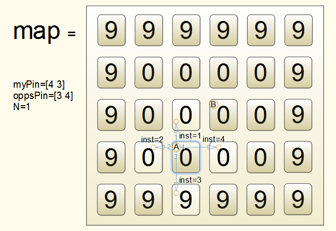

# 腹泻生物 ------Matlab对抗编程游戏

在宇宙深处的某个角落,有一颗神秘的星球,这颗星球上生活这一种古老而又奇特的生物:

 >  * 它们热爱运动,每时每刻都不停的行进,
>  * 它们的消化系统很不发达,每走一步都要拉肚子.
>  * 它们的免疫系统特别脆弱,一旦接触到自己或是其它生物的粪便便立刻死亡.

不错!它们就是传说中的**腹泻生物**.

随着这颗星球上的人口增长和污染加剧,可供腹泻生物们的活动区域不断减少. 腹泻生物们也逐渐被分割在了不同的有限空间内.为了能生存更长的时间,每个腹泻生物都在苦苦探索,并不断追寻着一条合适的线路.以便保证自己可以在更长的时间内不踏入粪便所在的区域.....

 在你看来腹泻生物这些与你毫无关系的生活,也许真的是糟透了.
 但是很不幸,由于穿越大流行,当你今天早上睁开眼的时候,
 你发现自己竟然穿越到了腹泻星球上,变成了一只腹泻生物!悲剧!
 从现在开始,为了生存你不得不开始与其它的腹泻生物争夺有限的空间.
 ___
## 游戏目标：
在一个由很多区域组成的封闭的平面地图(map)里,存在若干处于不同区域的腹泻生物.
 这些生物首先会在自己所在区域内留下粪便,使得该区域变成不能为所有腹泻生物接触的危险区域.
 然后它们同时移动到自己所在区域的相邻区域.
 此时如果其中某个生物踏入的新区域中存在排泄物,则该生物立刻死亡.
 只有那些转移到干净新区域的生物,才能继续存活,并开始新一轮的排泄移动过程.
 注意同时踏入同一区域的两只或多只腹泻生物均立即死亡.

  您需要做的就是在MATLAB下编写一个任意文件名的m函数(以下称为控制函数)文件,
 控制其中的一只生物在给定的地图(map)上的移动.
 每次生物移动前测试程序自动将地图(map)以及所有生物的位置信息作为参数传入您的控制函数
 您要做的就是通过控制函数的输出,给您所控制的生物下达移动指令,
 尽力使您所控制的生物能比其它控制函数控制下的生物存活更长的时间（更晚地踩到粪便）.
 在附件的 private 文件夹里,有 rigidmove.m , yieldingmove.m 等示例文件,
 它们中的任何一个都可以作为合格的控制文件.
 其中以 simplest.m 最为简单.有些函数的还需要图像处理工具箱的支持.
___
## 控制函数：
#### 1	您所要编写的控制函数的参数是固定的：

  请以
``` matlab
function inst = xxxxxx(map,myPin,oppsPin,N)
```
  作为您编写的控制函数的第一行.其中xxxxxx可以更换成您自己喜爱的合法的m函数名字.

####2	该函数接收4个均由测试程序自动输入的参数：

- map： m×n矩阵,map给出腹泻生物所处的封闭空间的描述.
              其标记了一个由m×n个区域组成的场地.
          map矩阵中的每一个元素代表一个区域,该元素的值标记了区域的状态.
          标记为0,表示没有大便的安全区域.
          标记为正整数的元素对应着存在大便的不安全区域,
          标记为9的点为天然存在的不安全区,
          标记为1,2,3,...u<9的点为由第u个腹泻生物通过自身排便创建的不安全区域
          m,n同时说明了地图的大小,目前m=n=30

- myPin：1×2的向量,myPin标记您控制的腹泻生物在地图（map）中的位置.
          myPin(1)为其所处行数,myPin(2)为该生物所处的列标.
          map(1,1)的区域行数是1,列数是1.
          map(m,n)的区域行数是m,列数是n.

- oppsPin：k×2的矩阵,oppsPin在同一张地图下的其它生物（竞争的腹泻生物）的位置.
          第k行的第一个元素为第k个参赛生物当前所处的行标,
          第k行的第二个元素的为第k个参赛生物当前所处的列标.
          k代表竞争生物的个数.目前k=1.

- N：测试函数调用该控制函数的次数
          代表腹泻生物将要在该地图上进行第N次移动

####3	该函数需要您输出一个参数：

- inst：您控制腹泻生物移动的方向.
         由于腹泻生物不停的排泄,所以腹泻生物不能停留在原地不动,
         每次都要移动一次位置,并在原地留下一堆粪便.
         inst给出了腹泻生物此次移动的方向.其只能有四个取值:1,2,3,4
               1: 向上移动,行标减一
               2: 向左移动,列标减一
               3: 向下移动,行标加一
               4: 向右移动,列标加一

####4	该函数的图例说明：*


假设测试函数自动向你编写的控制函数输入了一个5行6列的地图，如上图所示.
图中每个方块代表一个区域.
很显然该地图四周的区域为存在大便的不安全区域，因为那些区域都被map中取值为9的元素所标记.
相应的在地图中间有12个被0所标记的干净区域.

现在根据系统自动输入的参数myPin,可以看出您的控制函数控制的腹泻生物位于位置A.
而根据另外一个参数oppsPin,可以看出,有一个其它控制函数的控制下的腹泻生物位于位置B.
同时根据输入参数N=1,得知这两个生物将要进行第一次移动.在此之前双方都没有移动过.
 
如果经过你的控制代码的运算，返回了指令1，则将意味着生物甲下一步会向上移动至第三行第三列的位置
 如果返回指令2，3，4.生物甲也将按上图箭头指示方向做相应的移动.

但您的代码给出指令3，并不是一个好主意，因为这将使生物A踩到位于第五行第三列的粪便而死亡.

您的代码给出指令1，实际上也将面临风险.因为如果此时其它人的控制代码给生物B发出了指令2.
那么下一步将因为生物A与生物B同处一个区域而被测试程序判定同时死亡.
同理，生物A得到指令4的同时，生物B得到指令3，也将导致相同的结果.

当你的程序给出指令后,测试程序在收到两个控制程序发出的指令之后.
将在上述map的A位置和B位置分别写入1和2,标记新增的危险区域,进行地图map的更新.
同时根据两个控制指令刷新生物A和生物B的位置信息:myPin 和 oppsPin.
在刷新结束后,将再次调用游戏双方的控制代码进行计算.
如此反复,直到地图上只剩下一只生物.

####5	该函数的其他说明：
   该函数不限长度,不限执行时间（执行时间不要太过分）
   可以使用Matlab任何工具箱的函数
   而且允许外部调用

___
## 代码文件：
 我有编写供测试代码的附件,附件中有以下代码文件：

* generatemap.m:  由judgement自动调用生成地图map.
         它接受两个参数输入:
         第一个参数可以是0到8的任意一个整数数字,用来选择地图.
         第二个参数要求程序绘制选择的那个地图.
         例如:generatemap(randi([1,8]),1);

* survey.m:   由judgement自动调用的画图程序.
         动态显示腹泻生物的运动.

* judgement.m:    测试两个参赛代码(控制函数)
         它接受两个参数输入:
         第一个参数可以是0到8的任意一个整数数字,用来选择地图.
         第二个参数可以是0或1,用来制定是否动态的显示生物的移动.
         例如:generatemap(randi([1,8]),1);
___
## 如何测试：
下载附件,解压出 myrover 文件夹
将两个控制函数(可以是你的和别人的)放入 myrover 下的 private 文件夹下,
然后在MATLAB 中切换工作路径到 myrover 目录下,直接运行judgement函数,
在命令行窗口即可看到两个代码中的获胜代码的文件名.

  judgement,将首先调用 generatemap 生成地图.
 然后将 private 下的按文件名排序最靠前的两个函数 做为控制函数,
 并反复调用,根据他们返回的指令控制腹泻生物的运动.
 其间通过函数 survey 将生物的运动画出来.
 直到有一方的生物踩上了大便.judgement给出结果并结束运行.

 由于 private 文件夹下已经存在了两个已经编写好的控制函数,所以你也可以直接运行
judgement(randi([1,8]))

 您得到的图将与上图类似

 您可以多次运行judgement,然后对结果进行统计.
___
## 参与 交流 分享：
  本游戏任何人均可参加.
 下载附件后,通过使用matlab进行编程,编写控制函数
 利用附件中的程序即可对自己的代码进行测试.

  如果后面的帖子里有人贴出了自己的控制程序,你也可以下载来进行测试,研究.
 如果你有好的控制代码,也在跟贴里通过附件的形式发布出来,供大家学习分享.

 控制程序的优劣参见自己的测试结果.
___
## 背景说明：
 该游戏的灵感来自于很久之前我玩过的一个游戏以及
 matlab一个叫“Mars Surveyor”的编程竞赛：
 <http://www.mathworks.cn/matlabcentral/contest/contests/4/rules>

 这里有一个名叫 "tron battle" 的游戏:
 <http://www.codingame.com/multiplayer> 
这个帖子和这个游戏是一样的 ,不过不能用matlab编程要写的代码可能会更多.

 如果该版本的程序在您低版本的MATLAB中运行时报错,您可以尝试使用低版本的游戏代码:
 <http://www.ilovematlab.cn/thread-285238-1-1.html>

 目前本游戏仅支持双生物模式.
 如果以后会有更新,可以能会
 支持多人(代码)对抗,随机出生点,障碍,形状的地图.
 以及友好的交互方式,图形化的结果报告等.

 这是一个开放的游戏,我希望见到有人更改这个游戏代码,并发布新的游戏版本.

 控制代码写起来还是很复杂的,其中有很多复杂的逻辑.我自己写着写着都没兴趣了.
 我也知道不会有人花时间研究这个东西,这里只是把我的代码保存到论坛上.

 如果您发现游戏代码有bug或是错误,可以通知我.

 任何有关本游戏的疑问,都可以跟帖提问.我将尽力解答
___
## FAQ
 敬请期待,但估计永远都不会有
___
## 更新说明：
1. 针对 MATLAB 2014B 完善代码,提高速度.
2. 简化代码,加入注释,提高可读性.
3. 加入随机背景图片使游戏更加生动.
4. 增加地图,现在可以有八个地图可供选择.
5. 增加其它功能和更新说明文件.
6. 更新日期: 2015年2月28日


